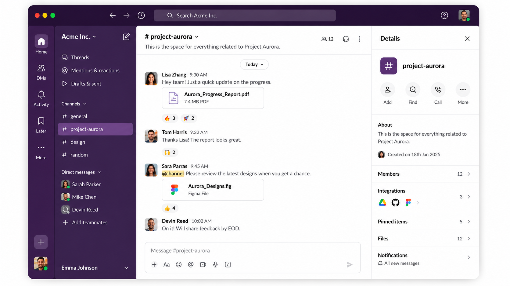
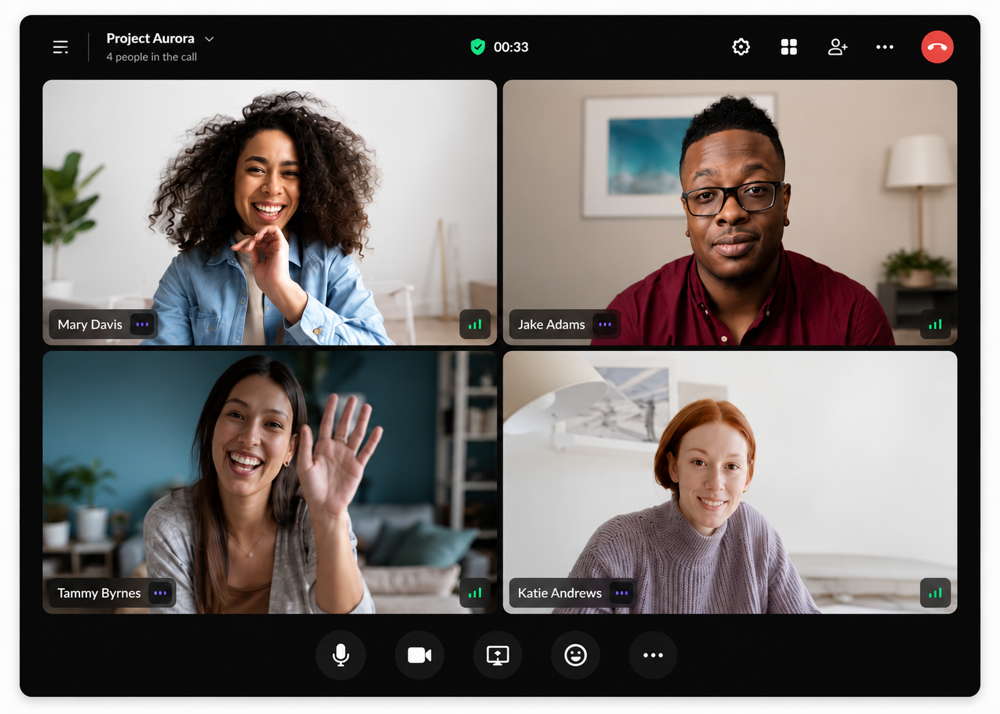

<h1 align="center">
🚀 Slack — Enterprise Team Collaboration Platform
</h1>

<p align="center">
A full-stack, production-ready team collaboration platform inspired by Slack, featuring real-time messaging, video conferencing, secure authentication, file sharing, threaded conversations, polls, and scalable backend architecture.
</p>

<p align="center">
  
  
  
  
  
  
  
</p>

---

# ✨ Key Features

## 💬 Real-Time Communication

- Real-time messaging using Stream
- Threaded conversations
- Emoji reactions
- Message editing & deletion
- Pinned messages
- Typing indicators
- Read receipts
- Online / Offline presence

---

## 👥 Workspace Collaboration

- Public & Private Channels
- Direct Messages
- Channel member management
- User profiles
- Workspace navigation

---

## 📹 Video Calling

- 1-on-1 video calls
- Group meetings
- Screen sharing
- Call recording
- Live emoji reactions
- Audio controls
- Camera controls

---

## 📂 File Sharing

- Images
- PDFs
- Documents
- ZIP Files
- Media attachments
- Drag & Drop Upload

---

## 📊 Poll System

- Multiple options
- Anonymous voting
- Poll comments
- Live vote updates
- Suggested answers

---

## 🔐 Authentication

- Clerk Authentication
- Protected Routes
- Session Management
- Secure User Profiles

---

# 📌 Project Overview

Slack is a full-stack team collaboration platform inspired by Slack, built with a scalable architecture for real-time communication. It enables teams to collaborate through instant messaging, video conferencing, file sharing, threaded discussions, and interactive polls. The platform leverages Stream for chat and video services, Clerk for authentication, Inngest for event-driven background workflows, and Sentry for production-grade monitoring and observability.

---

# 🛠 Tech Stack

### Frontend Technologies

- React
- Vite
- TailwindCSS
- Clerk
- Stream Chat SDK

### Backend Technologies

- Node.js
- Express.js
- MongoDB
- Stream APIs
- Inngest
- Sentry

### Dev Tools

- Git
- ESLint
- Prettier

---

# 🏗 Architecture

```text
                    Client
                       │
         React + Vite + Tailwind CSS
                       │
              REST APIs + Stream SDK
                       │
               Express.js Backend
          ┌────────────┼────────────┐
          │            │            │
      MongoDB      Stream APIs    Clerk
          │
     Inngest Jobs
          │
    Sentry Monitoring
```

---

# 🌟 Project Highlights

- 🚀 Production-ready full-stack architecture
- 💬 Real-time messaging and threaded conversations
- 📹 Integrated one-on-one and group video conferencing
- 🔐 Secure authentication and session management with Clerk
- ⚙️ Event-driven background workflows using Inngest
- 📈 Production-grade monitoring with Sentry
- 📂 File sharing and collaborative workspace features
- 📱 Responsive and modern user interface
- 📊 Interactive polling system for team collaboration

---

# 📦 Environment Variables

## Backend

```env
PORT=5001
MONGO_URI=your_mongo_uri_here

NODE_ENV=development

CLERK_PUBLISHABLE_KEY=
CLERK_SECRET_KEY=

STREAM_API_KEY=
STREAM_API_SECRET=

SENTRY_DSN=

INNGEST_EVENT_KEY=
INNGEST_SIGNING_KEY=

CLIENT_URL=http://localhost:5173
```

## Frontend

```env
VITE_CLERK_PUBLISHABLE_KEY=
VITE_STREAM_API_KEY=
VITE_SENTRY_DSN=
VITE_API_BASE_URL=http://localhost:5001/api
```

---

# ⚙️ Installation

## Clone Repository

```bash
git clone https://github.com/rahul810050/slack.git
cd slack
```

---

## Install Backend

```bash
cd backend
npm install
npm run dev
```

---

## Install Frontend

```bash
cd frontend
npm install
npm run dev
```

---

# 📷 Screenshots

<p align="center">
  
  
</p>

---

# 🎯 Future Improvements

- Message Search
- Workspace Invitations
- Push Notifications
- Voice Messages
- Message Scheduling
- End-to-End Encryption
- Role-Based Workspace Permissions

---

# ⭐ If you found this project helpful, consider giving it a star!